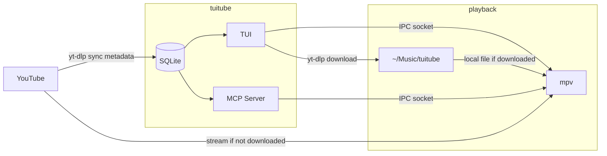

# tuitube


A terminal music player for curated YouTube channels. Syncs channels once via yt-dlp into a local SQLite library — search is instant, offline, and never hits an API. Streams via mpv. Fully programmable: control playback, manage playlists, and sync channels from any script, automation tool, or AI agent via the built-in MCP server.

## Features

- **Local-first SQLite library** — 8000+ tracks synced from curated channels (lofi, chill, trap, hip-hop, pop). Search with FTS5, no API calls, no rate limits, works offline
- **Stream instantly** via mpv — no downloads required, background audio
- **Download** tracks to `~/Music/tuitube` on demand
- **Favorites & playlists** — space to favorite, full playlist management from the keyboard
- **Autoplay queue** — enter on a track builds a queue from the current view
- **Seek, pause, next** — full playback control from the keyboard
- **Matrix & synthwave visualizers** — press `v` to cycle (matrix mode requires a unicode/Nerd Font — Menlo/Consolas will show blocks)
- **14 themes** — cycle with `ctrl+t`, live preview in the command palette
- **Programmable MCP server** — headless control over playback, search, playlists, and sync from any tool that supports MCP (Claude, scripts, automations)

## Architecture



## Stack

- [Bubble Tea v2](https://charm.land/bubbletea/v2) — TUI framework
- [Lip Gloss v2](https://charm.land/lipgloss/v2) — styling and layout
- [modernc.org/sqlite](https://gitlab.com/cznic/sqlite) — pure Go SQLite, no CGo
- `mpv` — headless audio playback with IPC socket
- `yt-dlp` — channel sync and audio downloads

## Screens

| Screen | Description |
|--------|-------------|
| Library | Searchable track table. Browse 8000+ songs, filter favorites, open playlists. |
| Playlists | Lobby — Favorites, user playlists, and stations. Enter to browse any collection. |
| Settings | Active theme and build info. |
| Help | Full keybinding reference. |
| Logs | App events + Claude agent activity log. |

## Keybindings

| Key | Action |
|-----|--------|
| `enter` | Play selected track (pause/resume if already playing) |
| `n` | Next track in queue |
| `p` | Pause / resume |
| `space` | Toggle favorite |
| `f` | Filter to favorites only |
| `d` | Download to `~/Music/tuitube` |
| `/` | Search — live FTS, esc to clear |
| `← →` | Seek ±5 seconds |
| `v` | Cycle visualizer (matrix → synthwave → off) |
| `s` | Toggle sidebar |
| `ctrl+t` | Cycle theme |
| `ctrl+k` | Command palette |
| `?` | Help screen |
| `q` | Quit |

## Setup

### Prerequisites

> **Platform:** Linux and macOS only. Windows is not supported (mpv IPC uses Unix sockets).

### macOS (Homebrew)

```bash
brew tap gitcoder89431/tuitube
brew install tuitube
```

This installs mpv and yt-dlp as dependencies. mpv has a large dependency tree (ffmpeg, codecs, etc.) — if you want a lighter install, use the binary release below and install mpv/yt-dlp separately.

On first launch, tuitube will automatically bootstrap the music catalog into your library.

### Linux (Arch / CachyOS)

```bash
paru -S mpv yt-dlp
```

Then install from the release tarball below.

### Install from release tarball

```bash
# Download the latest release for your platform
gh release download --repo gitcoder89431/tuitube --pattern "tuitube_*_darwin_arm64.tar.gz"
tar -xzf tuitube_*.tar.gz

# Move binary to PATH, then bootstrap from the extracted directory
sudo mv tuitube /usr/local/bin/
tuitube bootstrap --catalog ./catalog.db   # run from extracted directory
tuitube
```

### Install from source

```bash
git clone https://github.com/gitcoder89431/tuitube
cd tuitube
go build -o tuitube ./cmd/tuitube
tuitube bootstrap          # catalog.db is found automatically next to the binary
tuitube
```

### Add a new channel

```bash
tuitube add-station --url "https://www.youtube.com/@ChannelName/videos" --name "Display Name"
tuitube sync
```

### Sync new uploads

```bash
tuitube sync               # all stations
tuitube sync --station ID  # one station
```

### Prune dead links

Channels lose videos over time — uploads get set to private or taken down. `check-links` finds tracks whose YouTube video no longer plays:

```bash
tuitube check-links                 # report only (default)
tuitube check-links --prune         # remove confirmed-dead tracks
tuitube check-links --station ID    # one station
tuitube check-links --json          # machine-readable
```

Checking runs in two stages. A cheap oEmbed request clears most tracks in one HTTP call each; anything it doesn't return 200 for goes to `yt-dlp` — the same resolver mpv uses — and only its verdict counts. This matters because oEmbed returns 403 for videos that merely have embedding disabled but play fine.

Tracks are only pruned when yt-dlp reports them gone for everyone (private, removed, terminated account). Region blocks and transient failures are reported as `unknown` and never deleted.

## Programmable Control (MCP)

tuitube exposes 11 MCP tools for headless control — manage your library, control playback, and sync channels without the TUI open. Works with any MCP-compatible client.

| Tool | Params | What it does |
|------|--------|-------------|
| `search_tracks` | `query`, `favorites_only`, `limit` | Search library by artist/title |
| `play_track` | `youtube_id`, `title` | Stream a track via mpv |
| `stop_playback` | — | Stop current track |
| `toggle_favorite` | `track_id` | Favorite or unfavorite a track |
| `list_playlists` | — | List all playlists with track counts |
| `create_playlist` | `name` | Create a new playlist |
| `add_to_playlist` | `playlist_id`, `track_ids[]` | Add multiple tracks at once |
| `list_playlist_tracks` | `playlist_id` | List tracks in a playlist |
| `list_stations` | — | List all synced YouTube channels |
| `add_station` | `url`, `name`, `sync_now` | Add a YouTube channel |
| `sync_station` | `station_id` | Pull new uploads from a channel |

**Example prompts:**
- *"Make me a 20-track late night playlist and start playing it"*
- *"Add the NCS channel and sync it — https://www.youtube.com/@NCSMusic"*
- *"Search for something melancholic by Conan Gray and favorite it"*

**Setup (one-time):**
```bash
claude mcp add tuitube tuitube mcp
```

Or manually in `~/.claude.json`:

```json
{
  "mcpServers": {
    "tuitube": {
      "command": "/path/to/tuitube",
      "args": ["mcp"]
    }
  }
}
```

Then ask Claude to play songs, create playlists, or sync channels — no TUI required.

## Your Library

tuitube keeps data in two places:

- **Bundled catalog** — ships with each release, contains all pre-seeded stations and tracks. Updated when new channels are added upstream.
- **Your library** — your playlists, favorites, and downloads. Never touched on upgrade.
  - Linux: `~/.local/share/tuitube/tuitube.db`
  - macOS: `~/Library/Application Support/tuitube/tuitube.db`

On launch, tuitube automatically pulls any new tracks from the bundled catalog into your library. New music appears, nothing you've saved is changed. You can also add your own channels at any time with `tuitube add-station`.

## Credits

- **[elpdev](https://github.com/elpdev)** — `tuitheme`, `tuimod`, `tuilayout`, `tuipalette` — the component system this is built on
- **[bjarneo/cliamp](https://github.com/bjarneo/cliamp)** — matrix and synthwave visualizers, ported from MIT-licensed source
- **[KraXen72/shira](https://github.com/KraXen72/shira)** — `CleanTitle` title normalisation function, ported from MIT-licensed source

## Development

```bash
go run ./cmd/tuitube       # run with local DB
go test ./...              # tests
go build ./cmd/tuitube     # build check
./scripts/export_catalog.sh  # export catalog.db for a release
```
